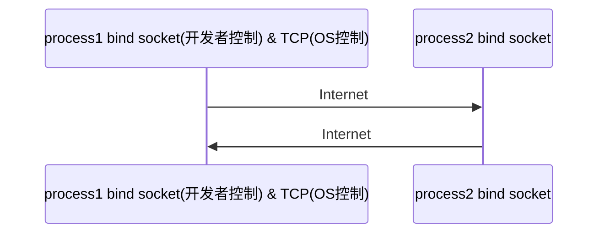

## 网络基础知识

#### OSI的七层模型
物理层、数据链路层、网络层、传输层、会话层、表示层、应用层

作为程序员了解到**传输层** 即可，传输层主要的协议TCP，UDP:
   + TCP : 传输控制协议，面向连接的，可靠的(对方一定能收到)
   + UDP : 用户数据报协议，不可靠的(速度快, 游戏中用, 延迟低)

IP : 尽力而为的，也是不可靠的

##### 进程寻址

路由器的前身就是网卡，一个出口对应了一个MAC地址。更像是数据链路层的东西

让我们将远端进程的访问看作是去拜访一个人
我们知道这个人的MAC地址，就通过路由器去它所在城市的路由器，到了之后再去他家在的楼(路由器)
楼里的不同房间就相当于不同的进程
每个进程出不了自己的房间，门牌号就相当于端口
Linux中这个数字是$2^{16} = 65536$个

进程是程序的实例化，是程序在内存的镜像

进程需要绑定(bind)在socket上才能访问传输层协议进行传输

#### 多路复用 多路分解

#### 三次握手 四次挥手

>SYN : 连接请求/接受报文段
>
>seq : 发送的第一个字节的序号(不是固定的)
>
>ACK : 确认报文段
>
>ack : 确认号。希望收到的下一个数据的字节号

init状态:

客户端Closed，服务端Listen。是由客户端主动向服务端建立连接

1. 连接请求，A(Client)向B(Server)发送SYN报文段。SYN = 1，seq = client_isn。SYN为synchronize,同步的意思。isn是初始化序列号(Initial Sequence Number)。客户端进入`SYN_SENT`状态
2. 连接允许，B向A发送SYNACK报文段，证明B收到了A的SYN。并指明自己的sever_isn，同时为了让客户端知道自己收到了先前的数据，将client_sin + 1作为ack，并且希望自己收到的下一个数据的开头序号是client_sin + 1。服务器处于`SYN_REVD`状态。
3. 客户端A收到了SYNACK，向服务器B再次发ACK 。将sever_isn + 1的值作为ACK的首字节序号，并希望在下次连接收到sever_isn + 1序号的数据。并向服务端B发送首字节序号为client_isn + 1的序列号。客户端进入`ESTABLISED`。至此证明A知道了B收到了自己的连接请求，建立TCP连接。服务器端也进入`ESTABLISED`。

**说人话**

第一次握手客户端什么也不能确认；服务器端确认了自己接收正常，确认了客户端发送正常

第二次客户端确认了自己接收和发送正常，服务端发送接收正常；服务端没有新确认

第三次客户端没有新确认；服务端确认了自己发送也正常，客户端接收也正常

小点：SYN = 1时数据报不能带数据

-------

>FIN : 连接终止位
>
>seq : 发送第一个字节的序号
>
>ACK : 确认报文段
>
>ack : 确认号，即希望下一个数据的第一个字节的序号

假设客户端先发起关闭请求:

1. 客户端A给服务器B发一个FIN = 1的报文，报文中指定seq = client_seq。*并停止在发送数据，关闭自己的TCP连接，进入半关闭状态*。客户端进入`FIN_WAIT1`，
2. 服务器收到 FIN 后，给客户端发 ACK ，ACK 的序号为 client_seq + 1，表示收到客户端的报文了。此时连接处于半关闭状态，客户端到服务器的已经关闭了，服务器到客户端的还在。服务器端接收了FIN ，发送ACK后进入`CLOSE_WAIT`，客户端收到服务器端的ACK后进入`FINWAIT_2`。
3. 如果服务器也想断开了，就给客户端发一个FIN，FIN 的seq = sever_seq(和上两步一样)，发完了服务器端进入`LAST_ACK`。
4. 客户端收到FIN，发一个seq = sever + 1的 ACK 报文给服务器，进入`TIME_WAIT`，等2MSL。
5. 其实叫 5 不太合适，叫 4.1 差不多。等 2MSL 后进入`CLOSED`。

值得注意的是，如果第四步中ACK没有传过去，过一段时间服务器端继续向客户端发FIN。而不是断掉连接，我们知道TCP连接的建立值在某些配置文件的基础之上的，如果服务器单方面断掉连接，此时客户端还在占用着此连接的相关文件。这样不好。这个等待的时间早前是最长30s，现在可能是最长4min了。

如果客户端在等待的时间中又收到了新的FIN，客户端会重置此等待时间然后再发一次ACK

这个等待时间其实是不固定的，最长是2MSL(Maximum Segment Lifetime)，即报文最大生存时间

RTT 即 报文来回的时间。这个每次来回的时间也是不固定的，每次TCP都会计算并且动态的更新RTT。
$$
        EstimatedRTT = (1-α)*EstimatedRTT + α*SampleRTT \\
               DevRTT = (1-β)*DevRTT + β*|SampleRTT - EstimatedRTT| \\
                     TimeoutInterval = EstimatedRTT + 4*DevRTT
$$

推荐的初始TimeoutInterval为1秒

并且如果在第四步服务端没收到客户端的ACK，她会认为是自己的FIN丢包了，在发送FIN后会加倍延长超时时间TimeoutInterval(网上说是指数)1s, 2s, 4s

##### WHY 4次？

因为TCP的**半关闭特性**，TCP 提供了连接的一端在结束它的发送后还能接收来自另一端数据的能力

在四次挥手的第一次和第三次，客户端和服务端都分别处在半关闭状态。

**通俗的来说，两次握手就可以释放一端到另一端的 TCP 连接，完全释放连接一共需要四次握手**。

举个例子：

>四次挥手新开连接用通俗的说法可以形象化地这样描述。
>男生：我们分手吧。
>女生：好的，我的东西收拾完，发信息给你。（此时男生不能再拥抱女生了。)
>（1个小时后）
>女生：我收拾好了，分手吧。（此时，女生也不能再拥抱男生了。）
>男生：好的。（此时，双方约定经过2个月的过渡期，双方才可以分别找新的对象。）

#### 客户端服务端状态序列转换

**一般来说客户端与服务端不是一成不变的，要看当前的业务**

比如在四次挥手的业务中，发起挥手的就是客户端

