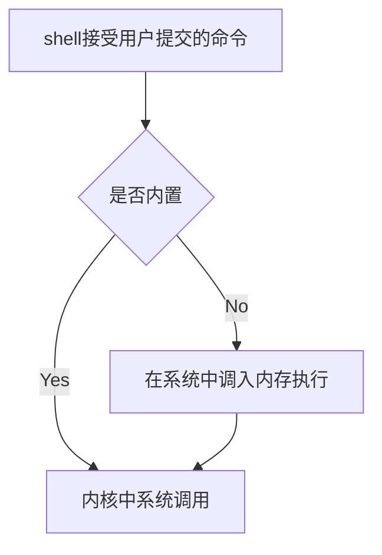

## Linux 基础知识和各种零碎

#### SHELL
SHELL是一个人机交互的接口，我们在shell中输入命令，它是怎么执行的呢？



#### 路径
绝对路径 相对路径和远程路径
讲下远程路径
一般格式为`协议://用户名:密码@位置/路径:端口`
远程路径其实具体都不一样，比如：
`http`和`ftp`

`pwd` print working directory

#### 软件

一般来说，一份软件包含的内容会分别拷贝到同级别的`bin, lib, share`和`/etc`下
因为是多用户系统，所以每个用户都有自己的`bin, lib, share`，但是`/etc`确只能有一个
```bash
❯ ll /etc
lrwxr-xr-x@ 1 root  wheel    11B Oct 18  2021 /etc -> private/etc
```
可以看到这是一个链接，指向的是`private/etc`
- bin 放程序的可执行文件，也就是二进制文件。在系统的环境变量将路径加进去就能在全局执行程序
因为Linux查找可执行程序是从`$PATH`下找的
- lib 库文件，方便共享
- share 存放程序需要的其他资源，一般是共享的，比如手册
- /etc 配置文件
- src 一些开源软件会把源码放在这里

#### 文件属性
```bash
❯ ll
total 10
drwxrwxr-x  20 root  admin   640B Jul  4 10:57 Applications
drwxr-xr-x  68 root  wheel   2.1K May  4 21:13 Library
drwxr-xr-x@  9 root  wheel   288B Oct 18  2021 System
drwxr-xr-x   5 root  admin   160B Oct 18  2021 Users
drwxr-xr-x   3 root  wheel    96B Jul  4 12:33 Volumes
drwxr-xr-x@ 38 root  wheel   1.2K Oct 18  2021 bin
drwxr-xr-x   2 root  wheel    64B Mar  3  2021 cores
dr-xr-xr-x   4 root  wheel   4.7K Jul  4 08:34 dev
lrwxr-xr-x@  1 root  wheel    11B Oct 18  2021 etc -> private/etc
lrwxr-xr-x   1 root  wheel    25B Jul  4 08:34 home -> /System/Volumes/Data/home
drwxr-xr-x   3 root  wheel    96B Sep 10  2021 opt
drwxr-xr-x   6 root  wheel   192B Oct 18  2021 private
drwxr-xr-x@ 65 root  wheel   2.0K Oct 18  2021 sbin
lrwxr-xr-x@  1 root  wheel    11B Oct 18  2021 tmp -> private/tmp
drwxr-xr-x@ 11 root  wheel   352B Oct 18  2021 usr
lrwxr-xr-x@  1 root  wheel    11B Oct 18  2021 var -> private/var
```

它分别列出了权限、文件数量、所属用户、所属组、文件大小、创建日期、文件名
以下面的为例
`lrwxr-xr-x@  1 root  wheel    11B Oct 18  2021 etc -> private/etc`
第一列基本就是4类

| 文件类型 | 所属用户权限 | 所属组权限 | 其他用户权限 |
| :------: | ------------ | ---------- | ------------ |
|    l     | rwx          | r-x        | r-x          |


可以看到这是一个链接文件，指向`private/etc`。这个`etc`可以说什么也没有

Linux一共有七种文件类型
- `-` regular file 普通文件
- `d` directory 目录文件
- `l` link 链接
- `b` block 块设备，存储数据以供系统读取的接口设备，也就是硬盘
- `c` character 字符设备，串口设备，键盘，鼠标等(无桌面系统的Linux将显示器作为字符设备)
- `s` socket 套接字
- `p` pipe 管道

其中，普通文件又可分为以下三种:

- 纯文本文件

  ASCII编码，可以直接读取。基本所有的配置文件都是这个类型。

- 二进制文件

  可执行文件(不包括脚本)，计算机只能执行二进制文件，不能用`cat`等读

- 数据格式的文件
  在一些程序运行过程中，需要读取特定格式的文件，这种文件被称为数据文件(data file)，一般也不能用`cat`读
  比如`/var/log/wtmp`


但是`ll`查看之后发现`/var/log/wtmp`是普通文件

```bash
❯ ll /var/log/wtmp
-rw-rw-r-- 1 root utmp 4.2K Jul  5 11:06 /var/log/wtmp
```

再比如常见的`.o`对象文件，也不能用`cat`读


```bash
 nm - list symbols from object files
```


#### 文件权限

与文件权限有关的命令：

```bash
chmod # change modify 改变文件权限
chown # 改变文件所属用户
chgrp # 改变文件所属组
```

##### chmod 用法

```bash
chmod a+x file # 给file的所有使用者(u, g, o)加上执行权限
chmod o-x file # 给file的others减去执行权限
chmod 755 file # 给file赋予rwxr-xr-x权限
chmod u=rwx, go=rx file # 同上
```

##### chown 用法

```bash
chown renboyu:haizei file # 修改file的所属用户是renboyu，所属组是haizei
chown -R renboyu:haizei directory # 修改目录directory及其下面所有的文件所属用户是renboyu，所属组是haizei -R 递归
chown renboyu file # 修改file的所属用户为renboyu
```

##### chgrp 用法

```bash
chgrp root file # 把file的组改成root
```

**Permission Denied 错误代码(errer no)是13**

#### alias

`alias`可查看所有的别名

注意在SHELL语系下空格有明确的含义，和C/C++不一样的。


加上空格相当于把它解析成了命令了！`a`被当成一个命令，而`= 2`被当成了命令的参数。


#### su 切换用户

普通用户如何获取管理员权限？很简单，自然是用`sudo`命令。

但是`sudo`的使用确实有严格限制的，只有在`/etc/sudoers`文件里的用户才能临时获得这个权限

```shell
# User privilege specification
root	ALL=(ALL:ALL) ALL

# Members of the admin group may gain root privileges
%admin ALL=(ALL) ALL

# Allow members of group sudo to execute any command
%sudo	ALL=(ALL:ALL) ALL
```


##### `su - root`和`su root`有什么区别？


可以看到，`su - root`在切换到root用户后还切换到了root的家目录下

但是`su root`只切换到了root用户，还停留在pi用户的家目录下


##### `whoami`和`who am i`的区别

`whoami`打印当前的用户信息

比如我以pi的身份链接到pi1上，中途用`su - root`临时切换到root用户，这时`whoami`打印的是`root`

但是`who am i`却能识别出真身份来，打印原本的`pi`和登陆时间。
