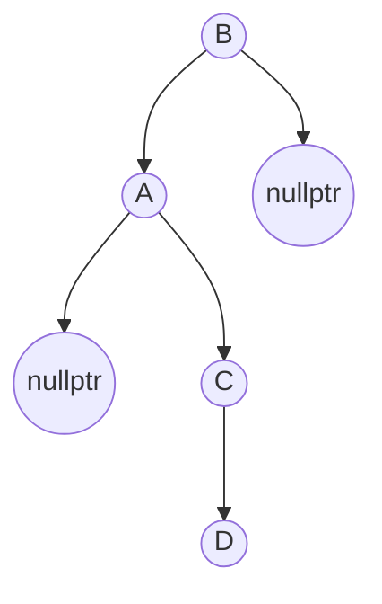

## BSTree Template

#### 实现基本的插入
二叉排序树首先要对节点元素比较大小才能实现插入
所以要重载的运算符有一系列比较大小的`>, <, ==, !=`

二叉排序树的节点有一个数据域`data`，可以存储任意类型`T data;`
还要有存储左右孩子的指针

那么就有了二叉树Node的结构
```c++

class BSNode {
public :
    BSNode(const T &data)
    : data(data), lchild(nullptr), rchild(nullptr) {
    std::cout << "node constuctor" << std::endl;
    }
    bool operator<(const BSNode<T> &obj) { return this->data < obj.data; }
    bool operator>(const BSNode<T> &obj) { return obj.data < this->data; }
    bool operator!=(const BSNode<T> &obj) { return (*this > obj) || (*this < obj); }
    bool operator==(const BSNode<T> &obj) { return !(*this != obj); }
    std::shared_ptr<BSNode<T> > lchild, rchild;
    ~BSNode() {
        std::cout << "destuctor" << std::endl;
    }
    T data;
};

```

为了直观的查看二叉树的构造析构情况，也为了看是否有内存泄漏的问题，让构造和析构函数都输出。
下面经典插入，没啥好说的

```c++

template<typename T>
struct BSTree {
public :
    BSTree() : root(std::make_shared<BSNode<T> >(T())) {}
    void insert(const T &data) {
        //这里的root是虚拟根节点，它的lchild才是真正的根
        std::shared_ptr<BSNode<T> > p = this->root;
        std::shared_ptr<BSNode<T> > new_node = std::make_shared<BSNode<T> >(data);
        if (p->lchild == nullptr) {
            p->lchild = new_node;
            return ;
        }
        p = p->lchild;
        //new_node是待插入的节点，p是当前的节点
        while (*p != *new_node) {
            if (*p > *new_node) {
                if (p->lchild == nullptr) {
                    p->lchild = new_node;
                    break;
                }
                p = p->lchild;
            } else {
                if (p->rchild == nullptr) {
                    p->rchild = new_node;
                    break;
                }
                p = p->rchild;
            }
        }
        return ;
    }

```


#### 实现一个迭代器iterator

先看`std::set`里的迭代器用法

```c++
    for (std::set<int>::iterator iter = root_s.begin(); iter != root_s.end(); iter++) {
        cout << *iter << endl;
        cout << iter->first << endl;
    }
```

可以看出iterator重载了运算符(++, != , *, -> )

并且可以表现的像一个指针

同时每个类里都可以使用`iterator`，而不是用特定的`iterator_set`方法

这里用的是c++11里的智能指针`shared_ptr`
为了解决C++内存泄漏的问题，C++11引入了智能指针。

　　智能指针的原理是，接受一个申请好的内存地址，构造一个保存在栈上的智能指针对象，当程序退出栈的作用域范围后，由于栈上的变量自动被销毁，智能指针内部保存的内存也就被释放掉了（除非将智能指针保存起来）。

　　C++11提供了三种智能指针：``std::shared_ptr, std::unique_ptr, std::weak_ptr`使用时需添加头文件`<memory>`。

　　shared_ptr使用引用计数，每一个shared_ptr的拷贝都指向相同的内存。每使用他一次，内部的引用计数加1，每析构一次，内部的引用计数减1，减为0时，删除所指向的堆内存。shared_ptr内部的引用计数是安全的，但是对象的读取需要加锁。

这就需要有一个BSTree_iterator类，里面封装一些迭代器的方法

```c++

template<typename T>
class BSTree_iterator {
public :
    BSTree_iterator() : node(nullptr) {}
    BSTree_iterator(std::shared_ptr<BSNode<T> > node) : node(node) {}
    BSTree_iterator<T> &operator++() {
    }
    BSTree_iterator<T> operator++(int) {
    }
    bool operator==(const BSTree_iterator<T> &iter) {
        return this->node == iter.node;
    }
    bool operator!=(const BSTree_iterator<T> &iter) {
        return this->node != iter.node;
    }
    T &operator*() {
        return node->data;
    }
private :
    std::shared_ptr<BSNode<T> > node;
};

```

假设有迭代器`iter`，迭代器的`++iter & iter++`需要我们分别实现
其实就是找iter的下一个，即后继

对于一般的点来说后继是其右子树的最左边的节点，但是如果这个点没有右子树呢？

后继就应该是的往上找的未被访问过第一个节点，所以为了方便，BSNode还需存储father信息

这里的`father`要用`std::weak_ptr` WHY?


如果是这种情况加上两者都是`shared_ptr`，就产生了环形引用

因为`shared_ptr`有一个引用计数的功能，允许多个指针指向一个对象，就是多来一个指针`count += 1;`

`count == 0`时释放资源，也就是析构。特别像信号量机制对吧。

但是如果发生上述情况即new_node中指针指向了father，father中的child域也指向了new_node

此时new_node 和 father中的引用计数一直为1，无法析构，就造成了内存泄漏

##### 为了避免环形引用 可以用weak_ptr

weak_ptr更像是shared_ptr的一个助手而不是智能指针，因为它不具有普通指针的行为，没有重载operator*和->

它的最大作用在于协助shared_ptr工作，像旁观者那样观测资源的使用情况.

也就是weak_ptr并不拥有自己指向对象的内存，只是拥有它的访问权限。

并且weak_ptr不能单独存在，必须配合shared_ptr。也就是weak_ptr指向一片shared_ptr指向的区域

但是 `weak_ptr.lock()` 可返回它指向内存的shared_ptr对象，且在所指对象内存已经无效时，返回指针空值(nullptr) *


**回到找后继！**

首先确定father 的指向，让其在`insert()`里`new_node->father = p;` 即可，因为new_node不是p的child么

找后继就是右子树的最左边节点

```c++

        if (p->rchild) {
            p = p->rchild;
            while (p->lchild) p = p->lchild;
            return p;
        }

```

因为++new_node和new_node++都要找后继，所以不妨把它封装成一个方法
上面是右子树不为空的情况，如果为空就要向上找father
找到第一个向左拐的点



比如这种情况D的后继是B，所以向上找B的father。

2行走到了虚拟root节点，直接返回

走到3行代表`p->father->rchild != p;`即走到了A，此时返回A的father即为B


```c++
        while (p->father.lock() && p->father.lock()->rchild == p) p = p->father.lock();
        if (p->father.lock() == nullptr) return p;
        return p->father.lock();

```

下面重载`*, ==, !=`

```c++

template<typename T>
class BSTree_iterator {
    using helper = BSTree_helper<T>;
public :
    BSTree_iterator() : node(nullptr) {}
    BSTree_iterator(std::shared_ptr<BSNode<T> > node) : node(node) {}
    BSTree_iterator<T> &operator++() {
        node = helper::get_next(node);
        return this;
    }
    BSTree_iterator<T> operator++(int) {
        BSTree_iterator iter(*this);
        node = helper::get_next(node);
        return iter;
    }
    bool operator==(const BSTree_iterator<T> &iter) {
        return this->node == iter.node;
    }
    bool operator!=(const BSTree_iterator<T> &iter) {
        return this->node != iter.node;
    }
    T &operator*() {
        return node->data;
    }
private :
    std::shared_ptr<BSNode<T> > node;
};

```

在实现iterator.begin() iterator.end() 方法
因为root是虚拟根节点，所以返回root->lchild

end()方法返回的是最后一个节点，因为虚拟跟节点只有左子树，所以它必然是最后一个节点

这就大大简化了我们的操作，直接`return iterator(root);`即可

stl里的各种用到二叉树的模版，如set也是这么实现的


