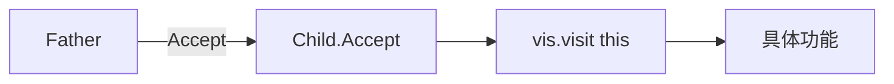
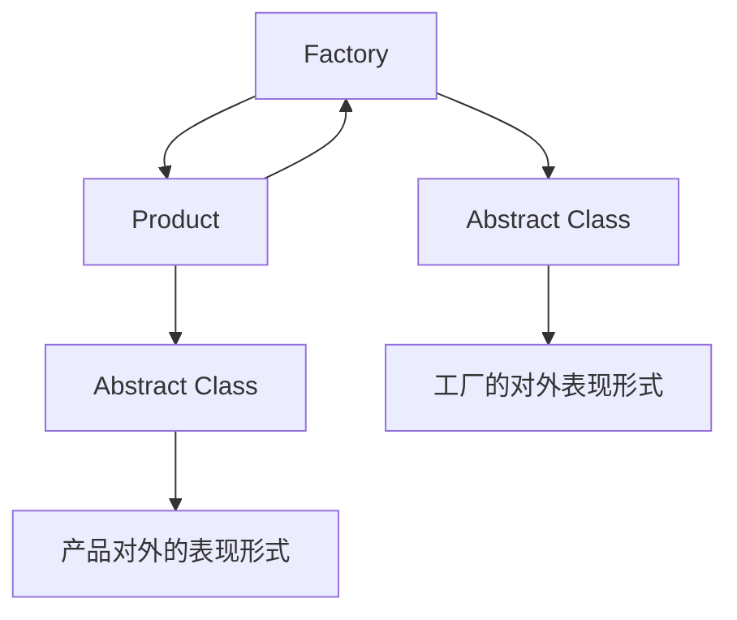

## design patterns - 设计模式
##### 设计模式解决的是什么问题？
简单说，是面向对象编程过程中的设计(design)问题
什么是design？可以理解为除了数据结构与算法，计算机网络，操作系统之外的问题
也就是我们还未遇到的问题

#### dynamic_cast
我们知道子类对象可以“退化”成父类指针
因为子类对象的存储空间头部存储的是父类的相关信息
但是父类指针怎么变成指向子类对象的呢
这里就要用到`dynamic_cast`

```shell
9.visitor.cpp:33:13: error: 'A' is not polymorphic
        if (dynamic_cast<B *>(arr[i])) {
            ^                 ~~~~~~
```

但是这样报错A不是多态的，我们知道多态是通过虚函数或者说虚函数表实现的
那为什么`dynamic_cast`需要类是多态的，或者说需要虚函数表呢？
因为只有在多态的情况下`class B, C, D`它们头部的虚函数表才都不一样
那么`dynamic_cast`的工作原理就是判断虚函数表是不是和某类一样，所以
它需要多态
又因为 了在调用`delete`的时候正确的析构
子类对象的空间，并且每个子类都必定调用析构函数
所以将析构函数显式的声明成虚函数
一石二鸟 
`virtual A() {}`


```c++
class A {
public :
    virtual ~A() {}
};

class B : public A {};
class C : public A {};
class D : public A {};

int main() {
    A *arr[10];
    srand(time(0));
    for (int i = 0; i < 10; i++) {
        switch (rand() % 3) {
            case 0 : arr[i] = new B(); break;
            case 1 : arr[i] = new C(); break;
            case 2 : arr[i] = new D(); break;
        } 
    }
    for (int i = 0; i < 10; i++) {
        if (dynamic_cast<B *>(arr[i])) {
            cout << "this is a class B obj" << endl;
        } else if (dynamic_cast<C *>(arr[i])) {
            cout << "this is a class C obj" << endl;
        } else if (dynamic_cast<C *>(arr[i])) {
            cout << "this is a class D obj" << endl;
        } else {
            cout << "this is a class A obj" << endl;
        }
    }
    return 0;
}
```
上面这段代码就是的功能就是根据父类指针(class A *)所指向对象的原始类型
作出不同的相应(cout << "this is class xxx obj" << endl;)


但是这段代码设计太垃圾了
如果新增一个E类的话
所有的要判断`else if`的条件分支都要再新增一个判断E的
如果忘加了，程序不会报错，会通过编译
但是运行的时候就会出问题
这就非常不好！因为你找不到错在哪里，这种逻辑上的错误

如果新增一个E类的话，不在`else if` 处新增判断
那么所有的E类都会当作A类输出，还不报错

**我们设计c++程序，一定要让错误尽可能多的在编译阶段暴露出来**
**而不是说程序运行起来通过看输出来判断，这就是访问者模式的作用**

-------
#### 访问者模式

访问者类`IVisitor`作为一个借口类 在要访问的类的基类下边
比如本代码里边就是放在`class A`下边，因为我们要访问`class A`的子类，派生类

它的类内部存放了相应子类的访问方法`visit(X *)`，自然都是纯虚函数
还需要在父类中声明一个接收子类访问者的方法`Accept(IVisitor *)`，也是纯虚函数
这样就必须在子类中对`Accept`重写
让它调用访问者的访问方法，并且传入当前对象的 `this`
```c++
public :
    void Accept(IVisitor *vis) {
        vis->visit(this);
    }
```

##### 下面定义访问者类
**每一个访问者类都对应了要映射的一套功能**

访问者类`OutputIVistor`父类是`A::IVisitor`
```c++
class OutputIVistor : public A::IVisitor {
    virtual void visit(B *obj) {
        cout << "this is a class B obj" << endl;
    }
    virtual void visit(C *obj) {
        cout << "this is a class C obj" << endl;
    }
    virtual void visit(D *obj) {
        cout << "this is a class D obj" << endl;
    }
    virtual void visit(E *obj) {
        cout << "this is a class E obj" << endl;
    }
};
class A {
    class IVisitor {
    public : 
        virtual void visit(B *) = 0;
        virtual void visit(C *) = 0;
        virtual void visit(D *) = 0;
        virtual void visit(E *) = 0;
    };
};

```
是不是每个类都对应了一个方法，输出此类的种类

```c++
    OutputIVistor vis;
    for (int i = 0; i < 10; i++) {
        arr[i]->Accept(&vis);
    }
```
并且对于数组`arr[i]`来说，每个位置存的都是BCDE四个对象的一种
其`Accept`方法是个纯虚函数方法，并且我们知道纯虚函数是跟着对象走的
如果`arr[i]`里存的是C类对象，那么会准确的调用到`C的Accept`方法
C中的成员方法`Accept(IVisitor *vis) { vis->visit(this); }`
这个this指针是C类型
又因为传入的参数`&vis`是`OutputIVistor *`

所以这个`visit`方法又对应到了`OutputIVistor::visit(C *obj)`上
**综上：类型映射是通过虚函数完成的，类型到功能的映射是访问者类完成的**

##### 访问者模式的优点:
1. 解决了之前`else if`代码对于新增的类即使不添加相应的判断语句也不报错的BUG。访问者模式下新增了类，只要没添加纯虚函数和访问者类，在编译的时候就会报错
2. 解决了之前`else if`逻辑冗余，时间效率低下。它的时间效率是和派生类的数量成正比的。但是访问者模式下，直接就可通过两个映射调用到
`father-Accept->child.Accept(&vis)->vis.vistor(&child)->相关功能`




3. 整个程序设计起来更加明了

#### 随堂作业
设计一个计算类
对于每个类分别做不同的计算，最后输出每次计算的结果


#### 单例模式(Singleton Pattern)

所谓单例模式，就是我们希望这个类只能又一个对象
比如经典的 Http 服务器，虽然物理上可能有很多，但是程序中我们希望只有一个
也就是不能用
```c++
HttpServer h1;
HttpServer h2(h1);
```
默认构造函数和拷贝构造函数
这个简单，将默认构造函数和拷贝构造函数声明为`private`
外边就没办法访问了
但是这样问题又来了
```c++
9.singleton_pattern.cpp:32:16: error: calling a private constructor of class 'HttpServer'
    HttpServer h1;
               ^
9.singleton_pattern.cpp:24:5: note: declared private here
    HttpServer() {}
    ^
```
调用不了构造函数了，怎么造一个派生类出来啊
我们可以在`HttpServer`类`public`中用`static`方法来访问`private`属性
达到曲线救国
```c++
class HttpServer {
public :
    static HttpServer *getInstance() {
        if (instance == nullptr) {
            instance = new HttpServer();
        }
        return instance;
    }
private :
    static HttpServer *instance;
    HttpServer() {}
    HttpServer(const HttpServer &) = delete;
};
HttpServer *HttpServer::instance = nullptr;
```

如果`instance`为空就初始化，也就是第一次时
这样无论调用多少次`HttpServer::getInstance`
都是指向一个的
```c++
int main() {
    HttpServer *t1 = HttpServer::getInstance();
    HttpServer *t2 = HttpServer::getInstance();
    cout << t1 << "\t" << t2 << endl;
    return 0;
}
```

#### 但是这个单例模式还存在很多的BUG
1. BUG1 - 如果`delete`掉`t1`的话，`t2`依然会指向那个被`delete`掉的空地址
这样在用`t2`的成员属性的时候就出大问题了!
在用`delete`方法的时候会调用对象的析构函数呀
所以设置成不让外部访问其成员属性析构函数不得了！
2. BUG2 - 多线程的情况下`getInstance`没有设置锁，当两个线程同时访问到这段代码时，会`new`出来两个对象
最终只有一个对象能指向，另一个对象就内存泄漏了。所以要给他加锁
`std::unique_lock<std::mutex> lock(m_mutex);`

除了加锁还有另一种方式，即在`instance`初始化的时候就给他赋初值
`HttpServer *HttpServer::instance = new HttpServer();`

同时将`getInstance`逻辑改成直接`return instance;`
```c++
    static HttpServer *getInstance() {
        return instance;
    }
```
一种是一开始不构造，等代码运行到这里了再构造，叫做懒汉模式。(直到非做不可才做)
另一种是不管你要不要，先构造了。叫饿汉模式
##### 改进后的懒汉模式(双重验证)
我们`getInstance`调用一次就加一次锁
这样会极大的影响多线程的效率
但是如果此实例被构造出来就不用再加锁了
所以在此之前再加一层判断
`if (instance == nullptr)`
这就是经典的双重验证

那为什么两个判断都要留着呢？
第一个是效率问题 第二个是bug
```c++
    static HttpServer *getInstance() {
        if (instance == nullptr) {
            std::unique_lock<std::mutex> lock(m_mutex);
            if (instance == nullptr) {
                instance = new HttpServer();
            }
        }
        return instance;
    }

```


#### 抽象工厂模式(Abstract Factory Pattern)
说到抽象，我们大多会想到抽象类(接口)


就好像工厂和产品的关系一样




比如有10个人，每个人都需要一个车，它们10个人不会自己造，而是说将需求给工厂，工厂根据需求来造车

所以在实际应用中，对于需要新对象的地方，我们是将它的实例化交给专门的类来做，还是哪里用到就在哪里`new`一个出来就显而易见了吧

所以说每个工厂都继承自工厂的抽象类，每个产品都继承自产品的抽象类

而不是说奔驰工厂和奔驰车在一起实例化，不是按品牌分的

**设计模式之于c++面向对象就像算法之于程序一样**

对于实例化新的派生类来说，不允许外部可以实例化
只有工厂可以创建并且实例化新的派生类
让外部创建不了非常简单，构造函数变成私有的即可
但是将构造和析构函数变成`private`，在主函数中`new`相关的`ICar`子类时
会有如下错误:
```shell
9.abstract_factory_pattern.cpp:31:9: error: call to implicitly-deleted default constructor of 'BenzCar'
    new BenzCar();
        ^
9.abstract_factory_pattern.cpp:21:17: note: default constructor of 'BenzCar' is implicitly deleted because base class 'ICar' has an inaccessible default constructor
class BenzCar : public ICar {};
                ^
```

这是因为父类中`private`的方法不能被除了自己以外所有的类访问
这就不对了，所以要改成`protected`，这样子类也可以访问

然后对于工厂方法来说也是抽象类
将`ICar`中的`run`方法设置成虚函数，这样每个类在继承`ICar`的时候都要重载`run`，变成自己的`run`方法

抽象工厂的接口是是现在产品类里面的
这样就能很方便的知道这个抽象工厂是生产的哪个产品
```c++
class ICar {
public :
    class IFactory {
    public :
        virtual ICar *create() = 0;
    };
    virtual void run() = 0;
protected :
    ICar() {}
    ~ICar() {}
};
```

`ICar::Factory.create()`即返回相关的对象实例

也就是`BenzCar::Factory.create()`重载之后返回奔驰车的对象

当然了`BenzCar::Factory : public ICar::Factory`
公有继承自抽象工厂的接口类

```c++
class ICar {
public :
    class IFactory {
    public :
        virtual ICar *create() = 0;
    };
    virtual void run() = 0;
protected :
    ICar() {}
    ~ICar() {}
};


class BenzCar : public ICar {
    BenzCar() {}
public :
    class Factory : public ICar::IFactory {
    public : 
        virtual ICar *create() {
            return new BenzCar();
        }
    };
    virtual void run() {
        cout << "Benz run" << endl;
    }
};
class BMWCar : public ICar {
public :
    class Factory : public ICar::IFactory {
    public : 
        virtual ICar *create() {
            return new BMWCar();
        }
    };
    BMWCar() {}
    virtual void run() {
        cout << "BMW run" << endl;
    }
};
class AudiCar : public ICar {
public :
    class Factory : public ICar::IFactory {
    public : 
        virtual ICar *create() {
            return new AudiCar();
        }
    };
    AudiCar() {}
    virtual void run() {
        cout << "Audi run" << endl;
    }
};

class Car {
public :
    int wheel_cnt, color, brand;
};

ICar::IFactory *fac[3] = {new BenzCar::Factory(), new AudiCar::Factory(), new BMWCar::Factory()};

int main() {
    ICar *cars[10];
    srand(time(0));
    for (int i = 0; i < 10; i++) {
        cars[i] = fac[rand() % 3]->create();
    }
    for (int i = 0; i < 10; i++) {
        cars[i]->run();
    }
    return 0;
}
```
如果我们想每个类的工厂只有一个
那就把它改成单例模式就可了
其实不同的设计模式都是相通的，可以组合的
前提就是你有相关的需求

**抽象工厂模式**
其实就是创建类的方法跟着类走，跟着自己走，同时也是跟着自己下边的类`Factory`走

如果没有抽象工厂，随机创建类的过程就是要`switch case`


